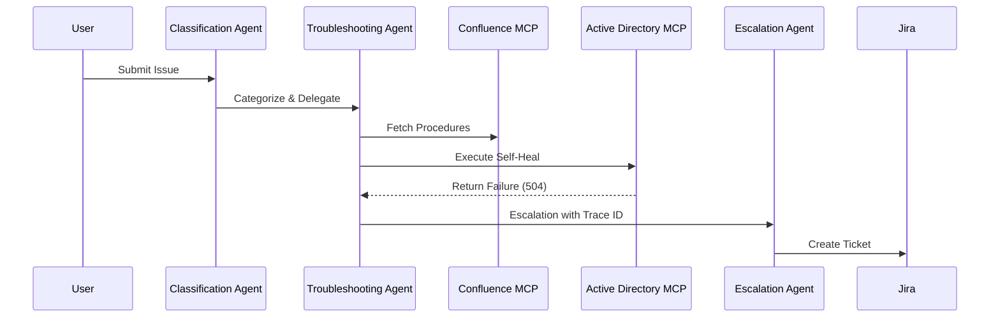

**1. Interaction Design Principle**

The Autonomous IT Helpdesk follows an Orchestration Pattern. The Troubleshooting Agent acts as the central orchestrator, maintaining the "State" of the ticket. All interactions are stateless and event-driven, ensuring the system can recover from failures at any point in the workflow.

**2. A2A Message Schema (The "Context Handover" Protocol)**


When agents escalate, they pass a State Object. This ensures that the next agent (Human or AI) knows exactly what has been done.

```json
{
  "header": {
    "sender": "TroubleshootingAgent",
    "receiver": "EscalationAgent",
    "timestamp": "2026-06-08T03:15:00Z",
    "message_id": "REQ-7721-AX",
    "trace_id": "TICKET-9921-2026"
  },
  "payload": {
    "action": "ESCALATE_TICKET",
    "ticket_state": {
      "user_id": "PGUPTA-99",
      "issue_type": "ACCESS_DENIED",
      "confidence_score": 0.42,
      "logs": [
        {"module": "LDAP", "status": "FAIL", "reason": "Timeout"},
        {"module": "VPN", "status": "SKIP", "reason": "Dependency failure"}
      ],
      "attempted_remediations": [
        "AD_CREDENTIAL_RESET",
        "CLEAR_DNS_CACHE"
      ]
    }
  }
}
```


**3. Interaction Workflow Logic**

In an industry setting, the interaction follows this sequence:

Request Capture: The Employee Portal publishes an event to the Message Bus.

Triaging (Classification Agent): The agent performs a "Classification Intent analysis." If the intent is ambiguous, it queries the Knowledge Base (Confluence MCP) for similar resolved issues.

Autonomous Resolution: If the Classification is ACCESS_ISSUE and the Confidence Score > 0.85, the Troubleshooting Agent attempts to execute the fix via Active Directory MCP.

Failure Handling (The Escalation Loop):

If the automated fix fails (e.g., connection timeout to LDAP), the TroubleshootingAgent updates the ticket_state.

It pushes this state to the Escalation Agent.

The Escalation Agent generates a formatted Markdown summary and posts it to Jira MCP using the CreateIssue endpoint.

**4. Sequence Diagram**



**5. Implementation Considerations for Industry**

Observability: Every interaction is logged to a centralized dashboard (e.g., ELK Stack) using the trace_id provided in the header. This allows developers to debug exactly where an agent failed.

Idempotency: When the Troubleshooting Agent calls the Active Directory MCP, it must check if the fix has already been attempted to prevent "infinite loops" of password reset requests.

Fallback Strategy: If the Confluence MCP returns no results, the agent is hard-coded to trigger the Escalation Agent immediately to prioritize user experience over continued failed attempts.


