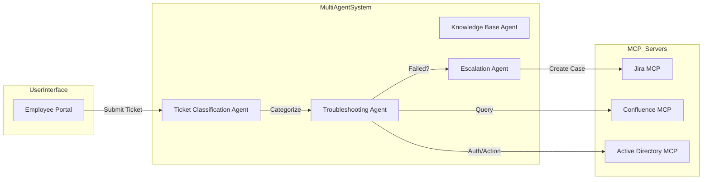

**Bold text**
#System Architecture: Autonomous IT Helpdesk
This system is an Intelligent Agentic Workflow designed to automate IT support operations. By leveraging a multi-agent framework, it reduces Mean Time to Resolution (MTTR) by automating Tier-1 support queries (password resets, access requests) and intelligently routing complex issues to human engineers in Jira.

##Component Specification (Industry Standard)
Ticket Classification Agent
Responsibility: Uses Natural Language Understanding (NLU) to categorize tickets into Access, Hardware, Software, or Security.

Industry Context: Implements a confidence threshold (e.g., if confidence < 0.85, it triggers the Escalation Agent automatically to avoid incorrect classification).

Troubleshooting Agent (The "Orchestrator")
Responsibility: The core reasoning engine. It executes a Chain-of-Thought (CoT) process:

Diagnose issue.

Check internal docs via Confluence MCP.

Attempt self-healing action via Active Directory MCP.

Reliability: Implements "Idempotency"—ensuring that running a fix multiple times does not result in duplicate account creation or permission overrides.

Escalation Agent
Responsibility: Handles "Context Handover."

Key Logic: It does not just send a raw ticket. It packages a Resolution_Summary JSON containing all previously attempted steps, error logs, and user metadata to ensure the human engineer has a full "Event History."

##Operational Protocols
A2A Communication: Agents communicate via asynchronous message queues. This ensures that if the Confluence MCP is down, the Troubleshooting Agent can retry the request with exponential backoff rather than crashing.

Security & Compliance: All interactions with Active Directory MCP are logged in a tamper-proof audit trail. The system requires an "Human-in-the-Loop" (HITL) approval for high-privilege access requests (e.g., granting admin rights).

##Technology Mapping
| Tool | Technology | Justification |
| :--- | :--- | :--- |
| Jira MCP | REST API | Standardizes issue tracking and SLA management. |
| Confluence MCP | Semantic Search | Allows for RAG (Retrieval Augmented Generation) on internal wiki docs. |
| Active Directory MCP | LDAP/Graph API | Provides secure, programmatic identity management. |

